# 08 — Diagramas UML

> **Proyecto:** SecurTex — Editor LaTeX Colaborativo Seguro
> **Notación:** UML 2.5 · renderizado con Mermaid (compatible con la vista previa de GitHub)
> **Versión:** 1.0

Índice de diagramas:

| § | Tipo de diagrama | Contenido |
|---|---|---|
| 1 | Paquetes | Organización del monorepo |
| 2 | Clases | Dominio de identidad, proyectos, edición y compilación |
| 3 | Secuencia | Registro, login federado, compilación, colaboración, revocación, subida |
| 4 | Actividad | Compilación con puntos de decisión de seguridad, invitación, publicación de plantilla |
| 5 | Estados | Proyecto, compilación, sesión, invitación, cambio rastreado, archivo |
| 6 | Componentes | Vista de componentes e interfaces |
| 7 | Despliegue | Nodos, artefactos y protocolos |
| 8 | Comunicación | Interacción entre servicios en la edición colaborativa |
| 9 | Temporización | Ventanas de vida de tokens y sesiones |

---

## 1. Diagrama de paquetes — estructura del monorepo

```mermaid
graph TB
    subgraph "apps"
        WEB["📦 web<br/>Next.js · SPA/PWA"]
        GW["📦 gateway<br/>NestJS · BFF"]
        AUTH["📦 auth-service"]
        PRJ["📦 project-service"]
        FILE["📦 file-service"]
        COLL["📦 collab-service"]
        REV["📦 review-service"]
        HIST["📦 history-service"]
        BIB["📦 bib-service"]
        TPL["📦 template-service"]
        INTG["📦 integration-service"]
        NOTIF["📦 notification-service"]
        ADMIN["📦 admin-service"]
        AUDIT["📦 audit-service"]
        ORCH["📦 compile-orchestrator (Rust)"]
        FETCH["📦 url-fetcher (Rust)"]
    end

    subgraph "packages · compartidos"
        CONTRACTS["📦 contracts<br/>DTO, esquemas Zod, tipos OpenAPI"]
        DOMAIN["📦 domain<br/>Entidades, objetos de valor, políticas"]
        SECURITY["📦 security<br/>Cripto, hashing, tokens, sanitizado"]
        DB["📦 db<br/>Prisma, migraciones, políticas RLS"]
        LATEX["📦 latex<br/>Parser, analizador estático, índice de comandos"]
        UI["📦 ui<br/>Componentes accesibles"]
        OBS["📦 observability<br/>OTel, logger sin PII"]
        TESTKIT["📦 testkit<br/>Fixtures, Testcontainers, utilidades de abuso"]
    end

    subgraph "infra"
        DOCKER["📦 docker"]
        K8S["📦 k8s · Helm"]
        TF["📦 terraform"]
        POLICIES["📦 policies · Kyverno, seccomp"]
    end

    WEB --> CONTRACTS
    WEB --> UI
    GW --> CONTRACTS
    GW --> SECURITY
    AUTH --> DOMAIN
    AUTH --> SECURITY
    AUTH --> DB
    PRJ --> DOMAIN
    PRJ --> DB
    FILE --> SECURITY
    FILE --> DB
    COLL --> DOMAIN
    ORCH --> LATEX
    TPL --> LATEX
    AUDIT --> SECURITY

    style SECURITY fill:#8b1a1a,color:#fff
    style LATEX fill:#8b1a1a,color:#fff
    style DOMAIN fill:#1a5c1a,color:#fff
```

**Regla de dependencias:** `apps/*` puede depender de `packages/*`; `packages/*` **nunca** depende de `apps/*`; `domain` no depende de nada externo. Se verifica en CI con `dependency-cruiser`.

---

## 2. Diagramas de clases

### 2.1 Dominio de identidad y acceso

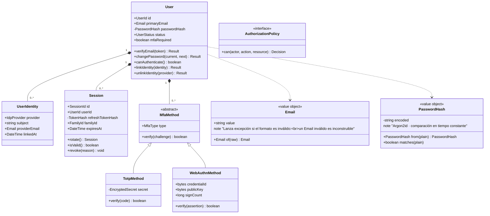
```mermaid
classDiagram
    class User {
        +UserId id
        +Email primaryEmail
        -PasswordHash passwordHash
        +UserStatus status
        +boolean mfaRequired
        +verifyEmail(token) Result
        +changePassword(current, next) Result
        +canAuthenticate() boolean
        +linkIdentity(identity) Result
        +unlinkIdentity(provider) Result
    }

    class UserIdentity {
        +IdpProvider provider
        +string subject
        +Email providerEmail
        +DateTime linkedAt
    }

    class Session {
        +SessionId id
        +UserId userId
        -TokenHash refreshTokenHash
        +FamilyId familyId
        +DateTime expiresAt
        +rotate() Session
        +isValid() boolean
        +revoke(reason) void
    }

    class MfaMethod {
        <<abstract>>
        +MfaType type
        +verify(challenge) boolean
    }
    class TotpMethod {
        -EncryptedSecret secret
        +verify(code) boolean
    }
    class WebAuthnMethod {
        +bytes credentialId
        +bytes publicKey
        +long signCount
        +verify(assertion) boolean
    }

    class Email {
        <<value object>>
        +string value
        +Email of(raw) Email
        note "Lanza excepción si el formato es inválido:<br/>un Email inválido es inconstruible"
    }

    class PasswordHash {
        <<value object>>
        -string encoded
        +PasswordHash from(plain) PasswordHash
        +boolean matches(plain)
        note "Argon2id · comparación en tiempo constante"
    }

    class AuthorizationPolicy {
        <<interface>>
        +can(actor, action, resource) Decision
    }

    User "1" *-- "0..*" UserIdentity
    User "1" *-- "0..*" Session
    User "1" *-- "0..*" MfaMethod
    MfaMethod <|-- TotpMethod
    MfaMethod <|-- WebAuthnMethod
    User ..> Email
    User ..> PasswordHash
```

### 2.2 Dominio de proyectos y control de acceso

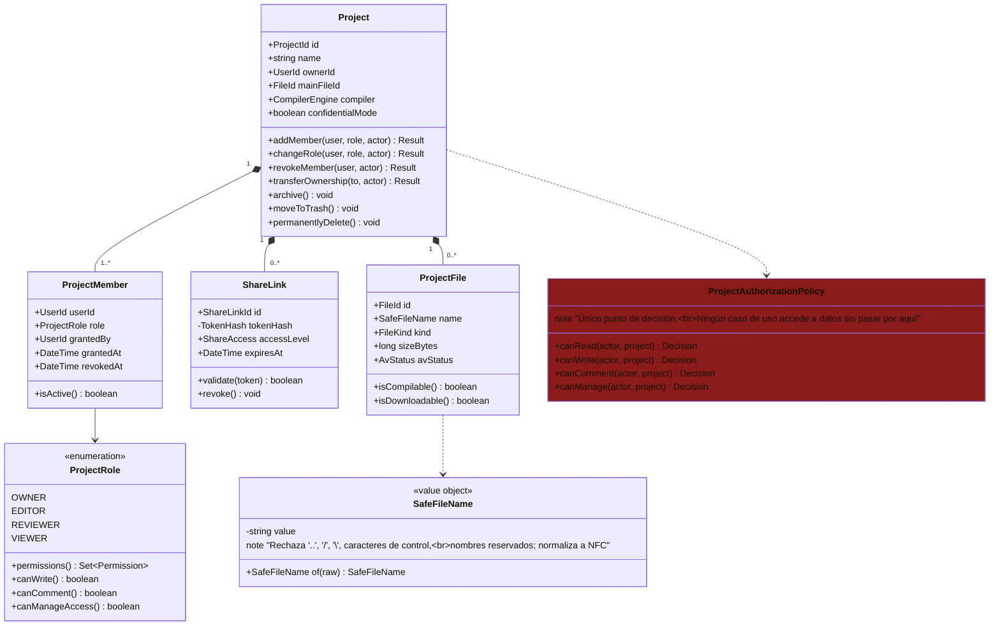
```mermaid
classDiagram
    class Project {
        +ProjectId id
        +string name
        +UserId ownerId
        +FileId mainFileId
        +CompilerEngine compiler
        +boolean confidentialMode
        +addMember(user, role, actor) Result
        +changeRole(user, role, actor) Result
        +revokeMember(user, actor) Result
        +transferOwnership(to, actor) Result
        +archive() void
        +moveToTrash() void
        +permanentlyDelete() void
    }

    class ProjectMember {
        +UserId userId
        +ProjectRole role
        +UserId grantedBy
        +DateTime grantedAt
        +DateTime revokedAt
        +isActive() boolean
    }

    class ProjectRole {
        <<enumeration>>
        OWNER
        EDITOR
        REVIEWER
        VIEWER
        +permissions() Set~Permission~
        +canWrite() boolean
        +canComment() boolean
        +canManageAccess() boolean
    }

    class ShareLink {
        +ShareLinkId id
        -TokenHash tokenHash
        +ShareAccess accessLevel
        +DateTime expiresAt
        +validate(token) boolean
        +revoke() void
    }

    class ProjectFile {
        +FileId id
        +SafeFileName name
        +FileKind kind
        +long sizeBytes
        +AvStatus avStatus
        +isCompilable() boolean
        +isDownloadable() boolean
    }

    class SafeFileName {
        <<value object>>
        -string value
        +SafeFileName of(raw) SafeFileName
        note "Rechaza '..', '/', '\\', caracteres de control,<br/>nombres reservados; normaliza a NFC"
    }

    class ProjectAuthorizationPolicy {
        +canRead(actor, project) Decision
        +canWrite(actor, project) Decision
        +canComment(actor, project) Decision
        +canManage(actor, project) Decision
        note "Único punto de decisión.<br/>Ningún caso de uso accede a datos sin pasar por aquí"
    }

    Project "1" *-- "1..*" ProjectMember
    Project "1" *-- "0..*" ShareLink
    Project "1" *-- "0..*" ProjectFile
    ProjectMember --> ProjectRole
    ProjectFile ..> SafeFileName
    Project ..> ProjectAuthorizationPolicy

    style ProjectAuthorizationPolicy fill:#8b1a1a
```

### 2.3 Dominio de compilación

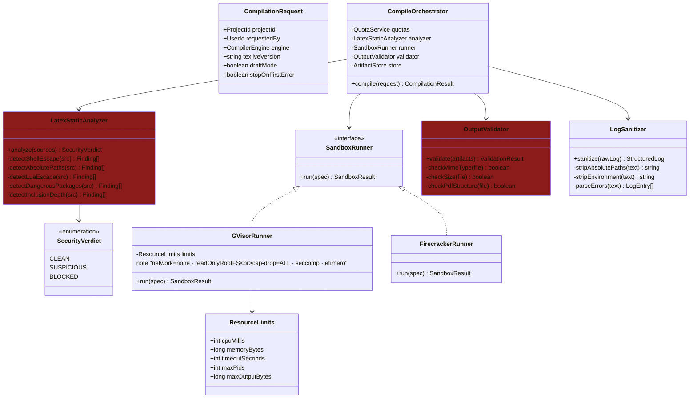
```mermaid
classDiagram
    class CompilationRequest {
        +ProjectId projectId
        +UserId requestedBy
        +CompilerEngine engine
        +string texliveVersion
        +boolean draftMode
        +boolean stopOnFirstError
    }

    class CompileOrchestrator {
        -QuotaService quotas
        -LatexStaticAnalyzer analyzer
        -SandboxRunner runner
        -OutputValidator validator
        -ArtifactStore store
        +compile(request) CompilationResult
    }

    class LatexStaticAnalyzer {
        +analyze(sources) SecurityVerdict
        -detectShellEscape(src) Finding[]
        -detectAbsolutePaths(src) Finding[]
        -detectLuaEscape(src) Finding[]
        -detectDangerousPackages(src) Finding[]
        -detectInclusionDepth(src) Finding[]
    }

    class SecurityVerdict {
        <<enumeration>>
        CLEAN
        SUSPICIOUS
        BLOCKED
    }

    class SandboxRunner {
        <<interface>>
        +run(spec) SandboxResult
    }
    class GVisorRunner {
        -ResourceLimits limits
        +run(spec) SandboxResult
        note "network=none · readOnlyRootFS<br/>cap-drop=ALL · seccomp · efímero"
    }
    class FirecrackerRunner {
        +run(spec) SandboxResult
    }

    class ResourceLimits {
        +int cpuMillis
        +long memoryBytes
        +int timeoutSeconds
        +int maxPids
        +long maxOutputBytes
    }

    class OutputValidator {
        +validate(artifacts) ValidationResult
        -checkMimeType(file) boolean
        -checkSize(file) boolean
        -checkPdfStructure(file) boolean
    }

    class LogSanitizer {
        +sanitize(rawLog) StructuredLog
        -stripAbsolutePaths(text) string
        -stripEnvironment(text) string
        -parseErrors(text) LogEntry[]
    }

    CompileOrchestrator --> LatexStaticAnalyzer
    CompileOrchestrator --> SandboxRunner
    CompileOrchestrator --> OutputValidator
    CompileOrchestrator --> LogSanitizer
    LatexStaticAnalyzer --> SecurityVerdict
    SandboxRunner <|.. GVisorRunner
    SandboxRunner <|.. FirecrackerRunner
    GVisorRunner --> ResourceLimits

    style LatexStaticAnalyzer fill:#8b1a1a
    style OutputValidator fill:#8b1a1a
```

### 2.4 Dominio de edición colaborativa

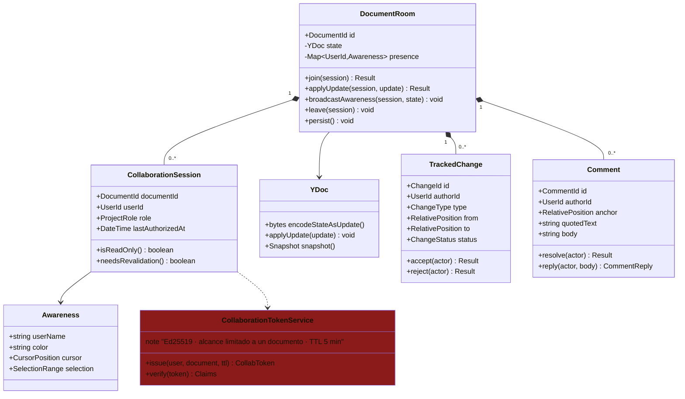
```mermaid
classDiagram
    class CollaborationSession {
        +DocumentId documentId
        +UserId userId
        +ProjectRole role
        +DateTime lastAuthorizedAt
        +isReadOnly() boolean
        +needsRevalidation() boolean
    }

    class DocumentRoom {
        +DocumentId id
        -YDoc state
        -Map~UserId,Awareness~ presence
        +join(session) Result
        +applyUpdate(session, update) Result
        +broadcastAwareness(session, state) void
        +leave(session) void
        +persist() void
    }

    class YDoc {
        +bytes encodeStateAsUpdate()
        +applyUpdate(update) void
        +Snapshot snapshot()
    }

    class Awareness {
        +string userName
        +string color
        +CursorPosition cursor
        +SelectionRange selection
    }

    class TrackedChange {
        +ChangeId id
        +UserId authorId
        +ChangeType type
        +RelativePosition from
        +RelativePosition to
        +ChangeStatus status
        +accept(actor) Result
        +reject(actor) Result
    }

    class Comment {
        +CommentId id
        +UserId authorId
        +RelativePosition anchor
        +string quotedText
        +string body
        +resolve(actor) Result
        +reply(actor, body) CommentReply
    }

    class CollaborationTokenService {
        +issue(user, document, ttl) CollabToken
        +verify(token) Claims
        note "Ed25519 · alcance limitado a un documento · TTL 5 min"
    }

    DocumentRoom "1" *-- "0..*" CollaborationSession
    DocumentRoom --> YDoc
    CollaborationSession --> Awareness
    DocumentRoom "1" *-- "0..*" TrackedChange
    DocumentRoom "1" *-- "0..*" Comment
    CollaborationSession ..> CollaborationTokenService

    style CollaborationTokenService fill:#8b1a1a
```

---

## 3. Diagramas de secuencia

### 3.1 Registro y verificación de correo (CU-01)

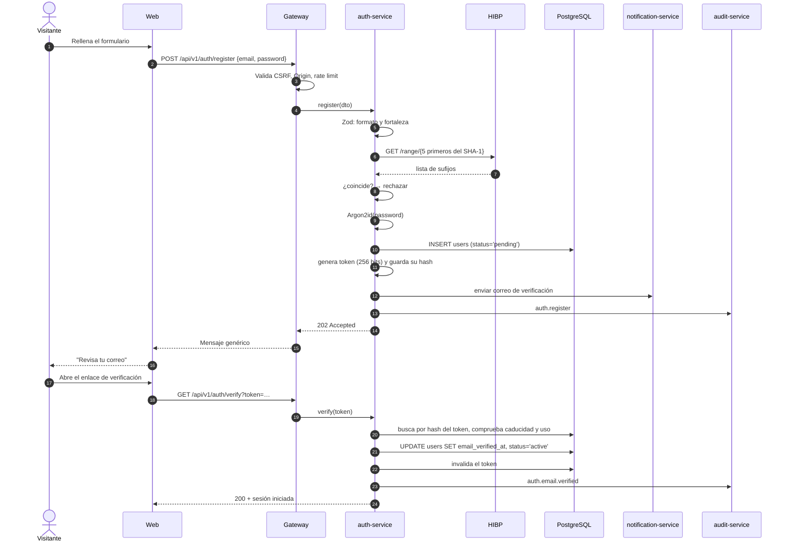
```mermaid
sequenceDiagram
    autonumber
    actor V as Visitante
    participant W as Web
    participant G as Gateway
    participant A as auth-service
    participant H as HIBP
    participant DB as PostgreSQL
    participant N as notification-service
    participant AU as audit-service

    V->>W: Rellena el formulario
    W->>G: POST /api/v1/auth/register {email, password}
    G->>G: Valida CSRF, Origin, rate limit
    G->>A: register(dto)
    A->>A: Zod: formato y fortaleza
    A->>H: GET /range/{5 primeros del SHA-1}
    H-->>A: lista de sufijos
    A->>A: ¿coincide? → rechazar
    A->>A: Argon2id(password)
    A->>DB: INSERT users (status='pending')
    A->>A: genera token (256 bits) y guarda su hash
    A->>N: enviar correo de verificación
    A->>AU: auth.register
    A-->>G: 202 Accepted
    G-->>W: Mensaje genérico
    W-->>V: "Revisa tu correo"

    V->>W: Abre el enlace de verificación
    W->>G: GET /api/v1/auth/verify?token=…
    G->>A: verify(token)
    A->>DB: busca por hash del token, comprueba caducidad y uso
    A->>DB: UPDATE users SET email_verified_at, status='active'
    A->>DB: invalida el token
    A->>AU: auth.email.verified
    A-->>W: 200 + sesión iniciada
```

### 3.2 Compilación con controles de seguridad (CU-21)

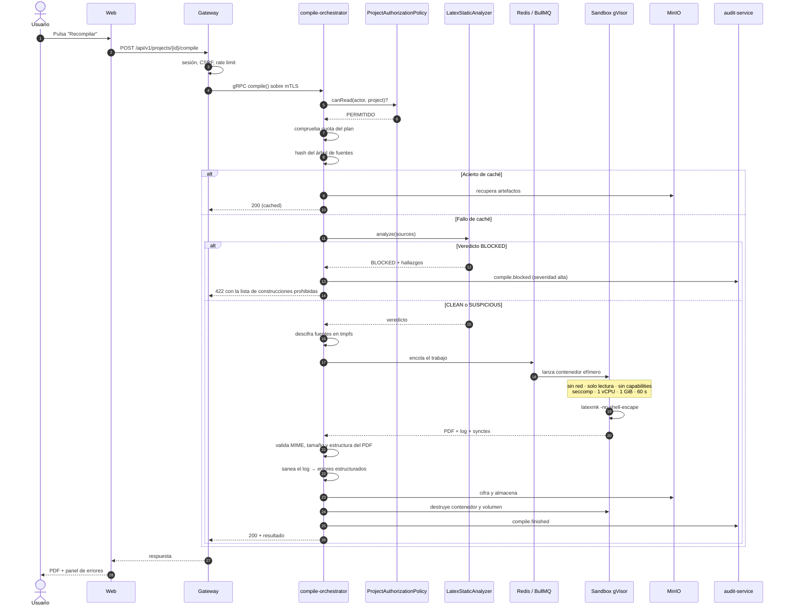
```mermaid
sequenceDiagram
    autonumber
    actor U as Usuario
    participant W as Web
    participant G as Gateway
    participant O as compile-orchestrator
    participant P as ProjectAuthorizationPolicy
    participant L as LatexStaticAnalyzer
    participant Q as Redis / BullMQ
    participant S as Sandbox gVisor
    participant M as MinIO
    participant AU as audit-service

    U->>W: Pulsa "Recompilar"
    W->>G: POST /api/v1/projects/{id}/compile
    G->>G: sesión, CSRF, rate limit
    G->>O: gRPC compile() sobre mTLS
    O->>P: canRead(actor, project)?
    P-->>O: PERMITIDO
    O->>O: comprueba cuota del plan
    O->>O: hash del árbol de fuentes

    alt Acierto de caché
        O->>M: recupera artefactos
        O-->>G: 200 (cached)
    else Fallo de caché
        O->>L: analyze(sources)
        alt Veredicto BLOCKED
            L-->>O: BLOCKED + hallazgos
            O->>AU: compile.blocked (severidad alta)
            O-->>G: 422 con la lista de construcciones prohibidas
        else CLEAN o SUSPICIOUS
            L-->>O: veredicto
            O->>O: descifra fuentes en tmpfs
            O->>Q: encola el trabajo
            Q->>S: lanza contenedor efímero
            Note over S: sin red · solo lectura · sin capabilities<br/>seccomp · 1 vCPU · 1 GiB · 60 s
            S->>S: latexmk -no-shell-escape
            S-->>O: PDF + log + synctex
            O->>O: valida MIME, tamaño y estructura del PDF
            O->>O: sanea el log → errores estructurados
            O->>M: cifra y almacena
            O->>S: destruye contenedor y volumen
            O->>AU: compile.finished
            O-->>G: 200 + resultado
        end
    end
    G-->>W: respuesta
    W-->>U: PDF + panel de errores
```

### 3.3 Colaboración en tiempo real y revocación en caliente

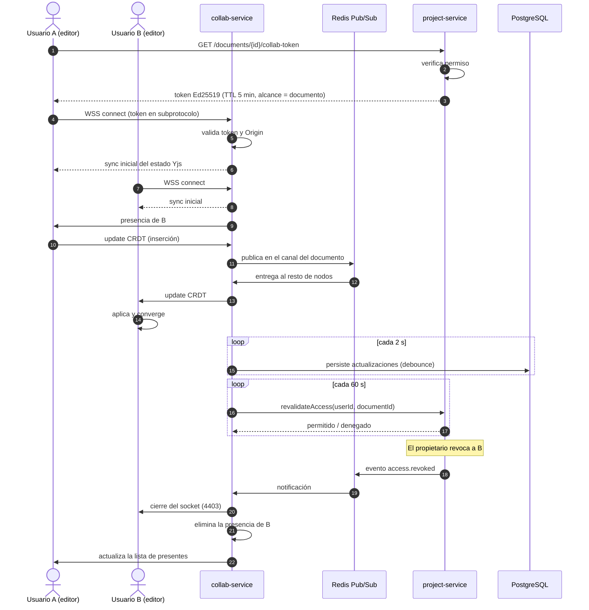
```mermaid
sequenceDiagram
    autonumber
    actor A as Usuario A (editor)
    actor B as Usuario B (editor)
    participant C as collab-service
    participant R as Redis Pub/Sub
    participant P as project-service
    participant DB as PostgreSQL

    A->>P: GET /documents/{id}/collab-token
    P->>P: verifica permiso
    P-->>A: token Ed25519 (TTL 5 min, alcance = documento)
    A->>C: WSS connect (token en subprotocolo)
    C->>C: valida token y Origin
    C-->>A: sync inicial del estado Yjs

    B->>C: WSS connect
    C-->>B: sync inicial
    C->>A: presencia de B

    A->>C: update CRDT (inserción)
    C->>R: publica en el canal del documento
    R->>C: entrega al resto de nodos
    C->>B: update CRDT
    B->>B: aplica y converge

    loop cada 2 s
        C->>DB: persiste actualizaciones (debounce)
    end

    loop cada 60 s
        C->>P: revalidateAccess(userId, documentId)
        P-->>C: permitido / denegado
    end

    Note over P: El propietario revoca a B
    P->>R: evento access.revoked
    R->>C: notificación
    C->>B: cierre del socket (4403)
    C->>C: elimina la presencia de B
    C->>A: actualiza la lista de presentes
```

### 3.4 Subida de archivo con análisis antimalware (CU-17)

```mermaid
sequenceDiagram
    autonumber
    actor E as Editor
    participant W as Web
    participant G as Gateway
    participant F as file-service
    participant AV as ClamAV
    participant V as Vault
    participant M as MinIO
    participant DB as PostgreSQL

    E->>W: arrastra figura.png
    W->>G: POST /projects/{id}/files (multipart)
    G->>G: límite de tamaño, rate limit
    G->>F: upload(dto)
    F->>F: canWrite(actor, project)?
    F->>F: SafeFileName.of(nombre)
    F->>F: detecta MIME real por magic bytes
    F->>F: comprueba cuota del proyecto
    F->>DB: INSERT project_files (av_status='pending')
    F->>M: almacena en cuarentena (clave = UUID)
    F->>AV: escanea
    alt Limpio
        AV-->>F: OK
        F->>V: genera DEK y la envuelve con la KEK del proyecto
        F->>M: guarda el contenido cifrado
        F->>DB: UPDATE av_status='clean'
        F-->>W: 201 Created
    else Infectado
        AV-->>F: VIRUS
        F->>DB: UPDATE av_status='infected'
        F->>F: bloquea el acceso; conserva en cuarentena
        F-->>W: 422 "Archivo rechazado por seguridad"
    end
```

### 3.5 Rotación de refresh token con detección de reutilización

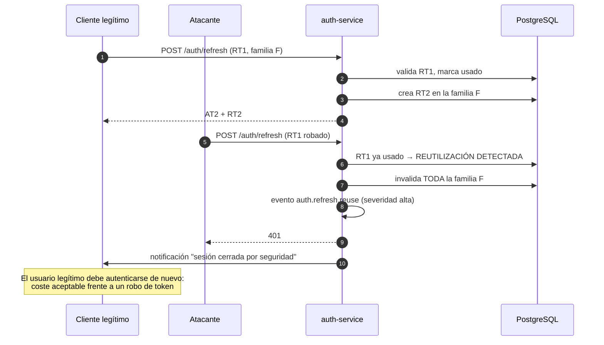
```mermaid
sequenceDiagram
    autonumber
    participant C as Cliente legítimo
    participant X as Atacante
    participant A as auth-service
    participant DB as PostgreSQL

    C->>A: POST /auth/refresh (RT1, familia F)
    A->>DB: valida RT1, marca usado
    A->>DB: crea RT2 en la familia F
    A-->>C: AT2 + RT2

    X->>A: POST /auth/refresh (RT1 robado)
    A->>DB: RT1 ya usado → REUTILIZACIÓN DETECTADA
    A->>DB: invalida TODA la familia F
    A->>A: evento auth.refresh.reuse (severidad alta)
    A-->>X: 401
    A->>C: notificación "sesión cerrada por seguridad"
    Note over C: El usuario legítimo debe autenticarse de nuevo:<br/>coste aceptable frente a un robo de token
```

---

## 4. Diagramas de actividad

### 4.1 Compilación: flujo con puntos de decisión de seguridad

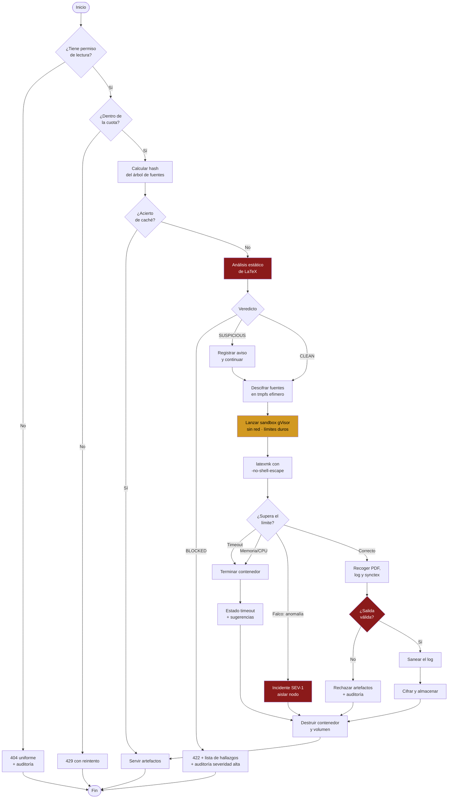
```mermaid
flowchart TD
    START([Inicio]) --> AUTHZ{¿Tiene permiso<br/>de lectura?}
    AUTHZ -->|No| E403[404 uniforme<br/>+ auditoría]
    AUTHZ -->|Sí| QUOTA{¿Dentro de<br/>la cuota?}
    QUOTA -->|No| E429[429 con reintento]
    QUOTA -->|Sí| HASH[Calcular hash<br/>del árbol de fuentes]
    HASH --> CACHE{¿Acierto<br/>de caché?}
    CACHE -->|Sí| SERVE[Servir artefactos]
    CACHE -->|No| ANALYZE[Análisis estático<br/>de LaTeX]
    ANALYZE --> VERDICT{Veredicto}
    VERDICT -->|BLOCKED| E422[422 + lista de hallazgos<br/>+ auditoría severidad alta]
    VERDICT -->|SUSPICIOUS| WARN[Registrar aviso<br/>y continuar]
    VERDICT -->|CLEAN| PREP
    WARN --> PREP[Descifrar fuentes<br/>en tmpfs efímero]
    PREP --> LAUNCH[Lanzar sandbox gVisor<br/>sin red · límites duros]
    LAUNCH --> RUN[latexmk con<br/>-no-shell-escape]
    RUN --> WATCH{¿Supera el<br/>límite?}
    WATCH -->|Timeout| KILL[Terminar contenedor]
    WATCH -->|Memoria/CPU| KILL
    WATCH -->|Falco: anomalía| INCIDENT[Incidente SEV-1<br/>aislar nodo]
    WATCH -->|Correcto| COLLECT[Recoger PDF,<br/>log y synctex]
    KILL --> ETIMEOUT[Estado timeout<br/>+ sugerencias]
    COLLECT --> VALIDATE{¿Salida<br/>válida?}
    VALIDATE -->|No| EINVALID[Rechazar artefactos<br/>+ auditoría]
    VALIDATE -->|Sí| SANITIZE[Sanear el log]
    SANITIZE --> STORE[Cifrar y almacenar]
    STORE --> DESTROY[Destruir contenedor<br/>y volumen]
    DESTROY --> SERVE
    SERVE --> END([Fin])
    E403 --> END
    E429 --> END
    E422 --> END
    ETIMEOUT --> DESTROY
    EINVALID --> DESTROY
    INCIDENT --> DESTROY

    style ANALYZE fill:#8b1a1a,color:#fff
    style VALIDATE fill:#8b1a1a,color:#fff
    style LAUNCH fill:#d29922,color:#000
    style INCIDENT fill:#8b1a1a,color:#fff
```

### 4.2 Invitación a colaborar (CU-14)

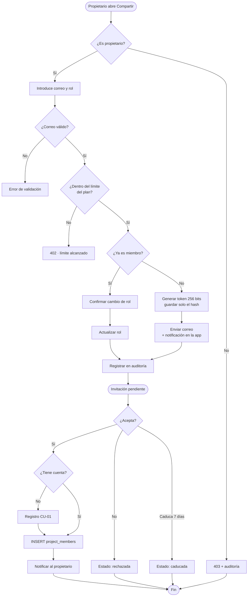
```mermaid
flowchart TD
    S([Propietario abre Compartir]) --> CHK{¿Es propietario?}
    CHK -->|No| DENY[403 + auditoría]
    CHK -->|Sí| FORM[Introduce correo y rol]
    FORM --> VAL{¿Correo válido?}
    VAL -->|No| ERR1[Error de validación]
    VAL -->|Sí| LIMIT{¿Dentro del límite<br/>del plan?}
    LIMIT -->|No| ERR2[402 · límite alcanzado]
    LIMIT -->|Sí| MEMBER{¿Ya es miembro?}
    MEMBER -->|Sí| CONFIRM[Confirmar cambio de rol]
    MEMBER -->|No| TOKEN[Generar token 256 bits<br/>guardar solo el hash]
    CONFIRM --> UPDATE[Actualizar rol] --> AUDIT
    TOKEN --> MAIL[Enviar correo<br/>+ notificación en la app]
    MAIL --> AUDIT[Registrar en auditoría]
    AUDIT --> WAIT([Invitación pendiente])
    WAIT --> ACCEPT{¿Acepta?}
    ACCEPT -->|Sí| HASACC{¿Tiene cuenta?}
    ACCEPT -->|No| DECLINE[Estado: rechazada]
    ACCEPT -->|Caduca 7 días| EXPIRE[Estado: caducada]
    HASACC -->|No| REG[Registro CU-01] --> ADD
    HASACC -->|Sí| ADD[INSERT project_members]
    ADD --> NOTIFY[Notificar al propietario] --> END([Fin])
    DECLINE --> END
    EXPIRE --> END
    DENY --> END
```

### 4.3 Publicación de una plantilla (CU-45)

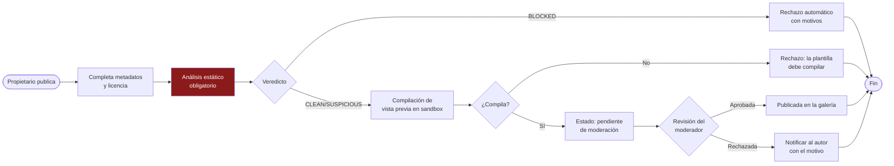
```mermaid
flowchart LR
    A([Propietario publica]) --> B[Completa metadatos<br/>y licencia]
    B --> C[Análisis estático<br/>obligatorio]
    C --> D{Veredicto}
    D -->|BLOCKED| E[Rechazo automático<br/>con motivos]
    D -->|CLEAN/SUSPICIOUS| F[Compilación de<br/>vista previa en sandbox]
    F --> G{¿Compila?}
    G -->|No| H[Rechazo: la plantilla<br/>debe compilar]
    G -->|Sí| I[Estado: pendiente<br/>de moderación]
    I --> J{Revisión del<br/>moderador}
    J -->|Aprobada| K[Publicada en la galería]
    J -->|Rechazada| L[Notificar al autor<br/>con el motivo]
    K --> M([Fin])
    E --> M
    H --> M
    L --> M

    style C fill:#8b1a1a,color:#fff
```

---

## 5. Diagramas de estados

### 5.1 Ciclo de vida de un proyecto

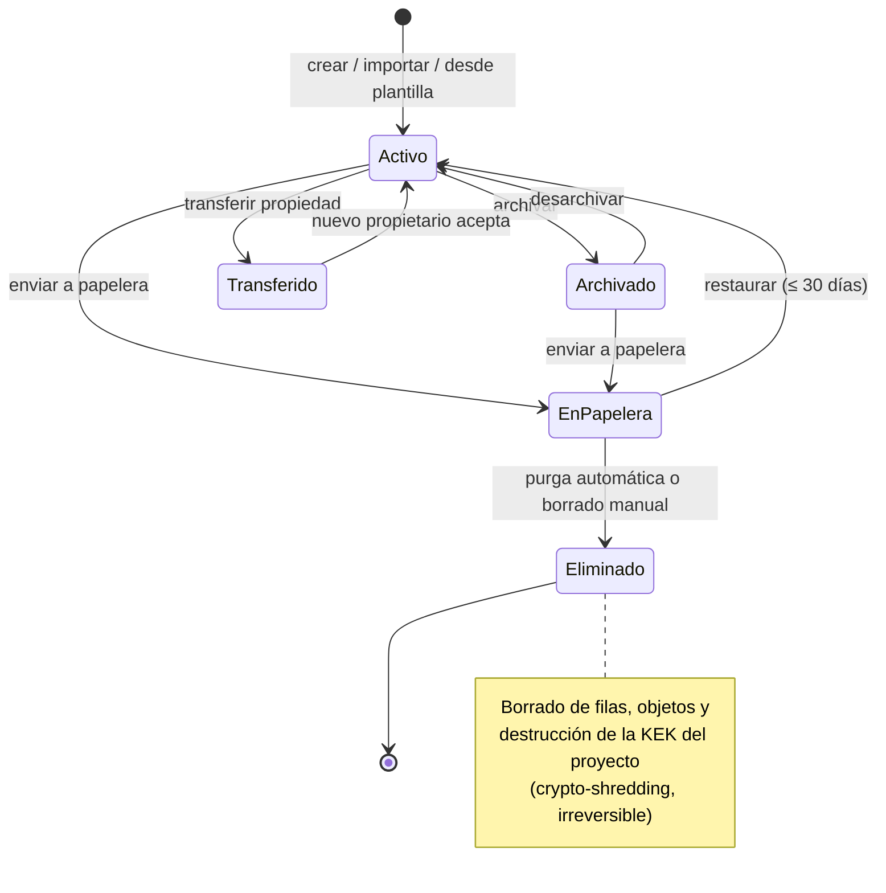
```mermaid
stateDiagram-v2
    [*] --> Activo: crear / importar / desde plantilla
    Activo --> Archivado: archivar
    Archivado --> Activo: desarchivar
    Activo --> EnPapelera: enviar a papelera
    Archivado --> EnPapelera: enviar a papelera
    EnPapelera --> Activo: restaurar (≤ 30 días)
    EnPapelera --> Eliminado: purga automática o borrado manual
    Activo --> Transferido: transferir propiedad
    Transferido --> Activo: nuevo propietario acepta
    Eliminado --> [*]

    note right of Eliminado
        Borrado de filas, objetos y
        destrucción de la KEK del proyecto
        (crypto-shredding, irreversible)
    end note
```

### 5.2 Ciclo de vida de una compilación

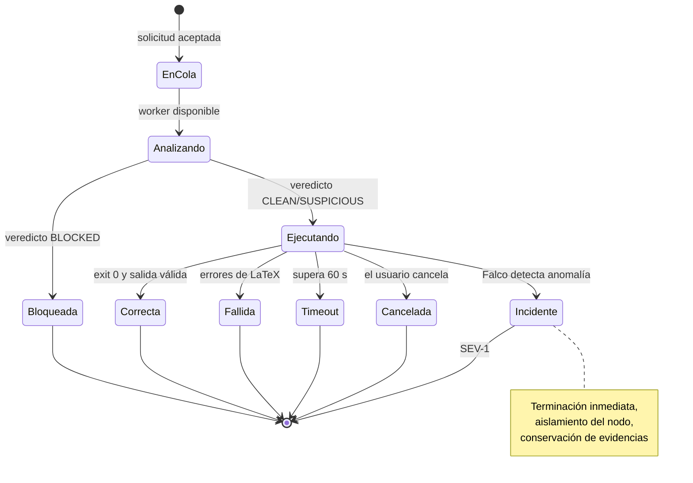
```mermaid
stateDiagram-v2
    [*] --> EnCola: solicitud aceptada
    EnCola --> Analizando: worker disponible
    Analizando --> Bloqueada: veredicto BLOCKED
    Analizando --> Ejecutando: veredicto CLEAN/SUSPICIOUS
    Ejecutando --> Correcta: exit 0 y salida válida
    Ejecutando --> Fallida: errores de LaTeX
    Ejecutando --> Timeout: supera 60 s
    Ejecutando --> Cancelada: el usuario cancela
    Ejecutando --> Incidente: Falco detecta anomalía
    Correcta --> [*]
    Fallida --> [*]
    Timeout --> [*]
    Bloqueada --> [*]
    Cancelada --> [*]
    Incidente --> [*]: SEV-1

    note right of Incidente
        Terminación inmediata,
        aislamiento del nodo,
        conservación de evidencias
    end note
```

### 5.3 Ciclo de vida de un archivo

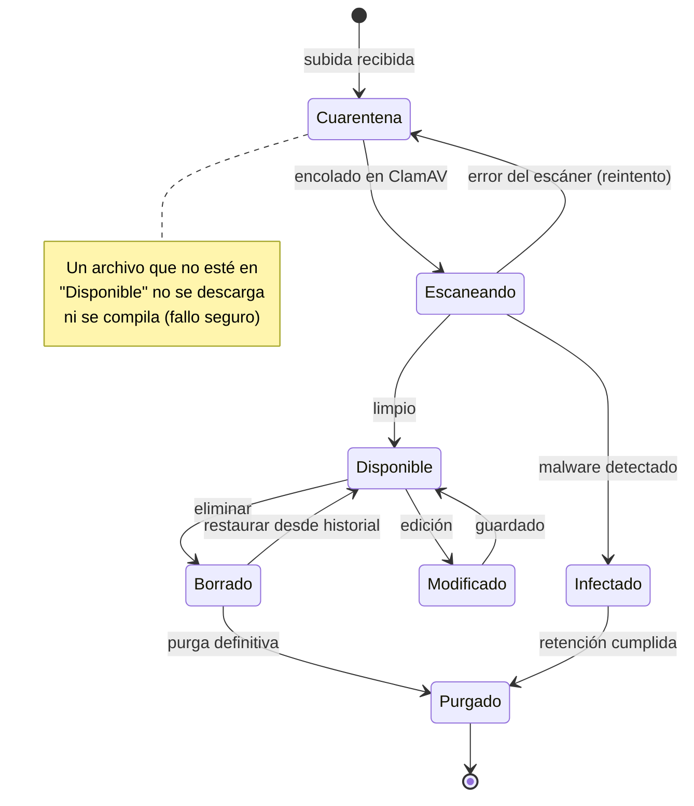
```mermaid
stateDiagram-v2
    [*] --> Cuarentena: subida recibida
    Cuarentena --> Escaneando: encolado en ClamAV
    Escaneando --> Disponible: limpio
    Escaneando --> Infectado: malware detectado
    Escaneando --> Cuarentena: error del escáner (reintento)
    Disponible --> Modificado: edición
    Modificado --> Disponible: guardado
    Disponible --> Borrado: eliminar
    Borrado --> Disponible: restaurar desde historial
    Borrado --> Purgado: purga definitiva
    Infectado --> Purgado: retención cumplida
    Purgado --> [*]

    note right of Cuarentena
        Un archivo que no esté en
        "Disponible" no se descarga
        ni se compila (fallo seguro)
    end note
```

### 5.4 Ciclo de vida de un cambio rastreado

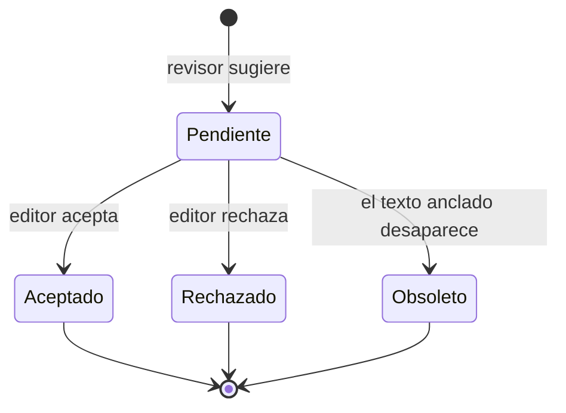
```mermaid
stateDiagram-v2
    [*] --> Pendiente: revisor sugiere
    Pendiente --> Aceptado: editor acepta
    Pendiente --> Rechazado: editor rechaza
    Pendiente --> Obsoleto: el texto anclado desaparece
    Aceptado --> [*]
    Rechazado --> [*]
    Obsoleto --> [*]
```

### 5.5 Ciclo de vida de una invitación

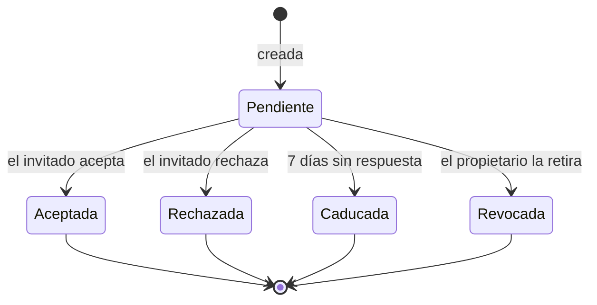
```mermaid
stateDiagram-v2
    [*] --> Pendiente: creada
    Pendiente --> Aceptada: el invitado acepta
    Pendiente --> Rechazada: el invitado rechaza
    Pendiente --> Caducada: 7 días sin respuesta
    Pendiente --> Revocada: el propietario la retira
    Aceptada --> [*]
    Rechazada --> [*]
    Caducada --> [*]
    Revocada --> [*]
```

---

## 6. Diagrama de componentes

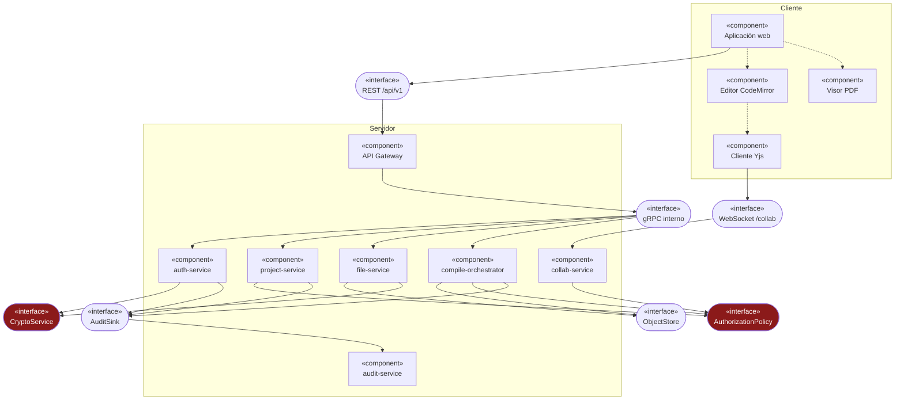
```mermaid
graph TB
    subgraph "Cliente"
        SPA["«component»<br/>Aplicación web"]
        EDITOR["«component»<br/>Editor CodeMirror"]
        VIEWER["«component»<br/>Visor PDF"]
        YCLIENT["«component»<br/>Cliente Yjs"]
    end

    subgraph "Servidor"
        GWC["«component»<br/>API Gateway"]
        AUTHC["«component»<br/>auth-service"]
        PRJC["«component»<br/>project-service"]
        FILEC["«component»<br/>file-service"]
        COLLC["«component»<br/>collab-service"]
        ORCHC["«component»<br/>compile-orchestrator"]
        AUDITC["«component»<br/>audit-service"]
    end

    IREST(["«interface»<br/>REST /api/v1"])
    IWS(["«interface»<br/>WebSocket /collab"])
    IGRPC(["«interface»<br/>gRPC interno"])
    ISTORE(["«interface»<br/>ObjectStore"])
    ICRYPTO(["«interface»<br/>CryptoService"])
    IPOLICY(["«interface»<br/>AuthorizationPolicy"])
    IAUDIT(["«interface»<br/>AuditSink"])

    SPA --> IREST
    YCLIENT --> IWS
    IREST --> GWC
    IWS --> COLLC
    GWC --> IGRPC
    IGRPC --> AUTHC
    IGRPC --> PRJC
    IGRPC --> FILEC
    IGRPC --> ORCHC
    FILEC --> ISTORE
    ORCHC --> ISTORE
    FILEC --> ICRYPTO
    AUTHC --> ICRYPTO
    PRJC --> IPOLICY
    COLLC --> IPOLICY
    ORCHC --> IPOLICY
    AUTHC --> IAUDIT
    PRJC --> IAUDIT
    ORCHC --> IAUDIT
    IAUDIT --> AUDITC
    SPA -.-> EDITOR
    SPA -.-> VIEWER
    EDITOR -.-> YCLIENT

    style IPOLICY fill:#8b1a1a,color:#fff
    style ICRYPTO fill:#8b1a1a,color:#fff
```

---

## 7. Diagrama de despliegue

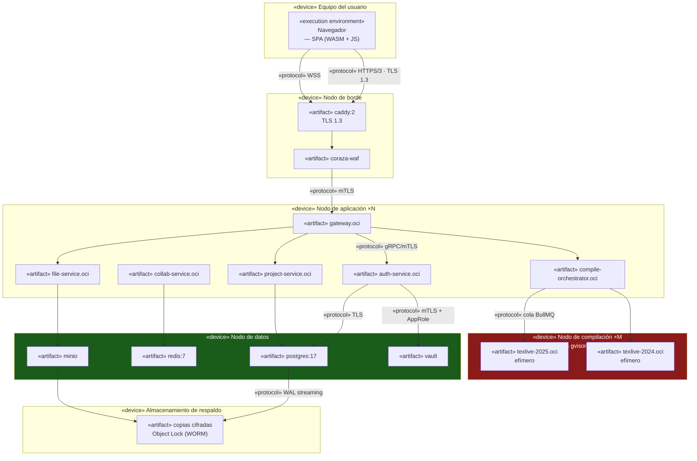
```mermaid
graph TB
    subgraph DEV["«device» Equipo del usuario"]
        BROW["«execution environment»<br/>Navegador<br/>— SPA (WASM + JS)"]
    end

    subgraph EDGE["«device» Nodo de borde"]
        CADDY["«artifact» caddy:2<br/>TLS 1.3"]
        CORAZA["«artifact» coraza-waf"]
    end

    subgraph WORKER1["«device» Nodo de aplicación ×N"]
        POD1["«artifact» gateway.oci"]
        POD2["«artifact» auth-service.oci"]
        POD3["«artifact» project-service.oci"]
        POD4["«artifact» file-service.oci"]
        POD5["«artifact» collab-service.oci"]
        POD6["«artifact» compile-orchestrator.oci"]
    end

    subgraph WORKER2["«device» Nodo de compilación ×M<br/>RuntimeClass gvisor · sin egress"]
        RUN1["«artifact» texlive-2025.oci<br/>efímero"]
        RUN2["«artifact» texlive-2024.oci<br/>efímero"]
    end

    subgraph DATA["«device» Nodo de datos"]
        PGN["«artifact» postgres:17"]
        RDN["«artifact» redis:7"]
        MIN["«artifact» minio"]
        VLT["«artifact» vault"]
    end

    subgraph BACKUP["«device» Almacenamiento de respaldo"]
        BK["«artifact» copias cifradas<br/>Object Lock (WORM)"]
    end

    BROW -->|"«protocol» HTTPS/3 · TLS 1.3"| CADDY
    BROW -->|"«protocol» WSS"| CADDY
    CADDY --> CORAZA
    CORAZA -->|"«protocol» mTLS"| POD1
    POD1 -->|"«protocol» gRPC/mTLS"| POD2
    POD1 --> POD3
    POD1 --> POD4
    POD1 --> POD6
    POD6 -->|"«protocol» cola BullMQ"| RUN1
    POD6 --> RUN2
    POD2 -->|"«protocol» TLS"| PGN
    POD3 --> PGN
    POD4 --> MIN
    POD5 --> RDN
    POD2 -->|"«protocol» mTLS + AppRole"| VLT
    PGN -->|"«protocol» WAL streaming"| BK
    MIN --> BK

    style WORKER2 fill:#8b1a1a,color:#fff
    style DATA fill:#1a5c1a,color:#fff
```

---

## 8. Diagrama de comunicación — edición colaborativa

```mermaid
graph LR
    A["1: usuario A escribe"] -->|"1.1 update(CRDT)"| C1["collab-service nodo 1"]
    C1 -->|"1.2 applyUpdate()"| Y1["YDoc sala"]
    C1 -->|"1.3 publish(canal)"| R["Redis Pub/Sub"]
    R -->|"1.4 deliver"| C2["collab-service nodo 2"]
    C2 -->|"1.5 broadcast"| B["usuario B"]
    C1 -->|"1.6 debounce 2 s"| DB["PostgreSQL"]
    C1 -->|"1.7 cada 60 s revalidate()"| P["project-service"]
    P -->|"1.8 decision"| C1
```

---

## 9. Diagrama de temporización — vida de tokens y sesiones

```mermaid
gantt
    title Ventanas de validez (escala logarítmica conceptual)
    dateFormat X
    axisFormat %s

    section Tokens
    Token de colaboración (5 min)     :0, 300
    Access token (10 min)             :0, 600
    Token de verificación (24 h)      :0, 86400
    Token de recuperación (30 min)    :0, 1800
    Invitación (7 días)               :0, 604800

    section Sesión
    Reautenticación válida (5 min)    :0, 300
    Inactividad máxima (12 h)         :0, 43200
    Vida máxima de sesión (7 días)    :0, 604800

    section Claves
    Certificado mTLS interno (24 h)   :0, 86400
    Clave de firma Ed25519 (30 días)  :0, 2592000
```

---

## 10. Convenciones y mantenimiento

- Los diagramas se escriben en **Mermaid dentro del Markdown** para que se versionen como texto y se revisen en los *pull requests*.
- Todo cambio de arquitectura obliga a actualizar el diagrama afectado **en el mismo PR**; el CI comprueba que los bloques Mermaid compilen.
- Los diagramas de secuencia deben numerar los pasos (`autonumber`) para poder referenciarlos en las revisiones.
- Los elementos con implicación directa de seguridad se colorean en **rojo** (`#8b1a1a`); los almacenes protegidos en **verde** (`#1a5c1a`); los puntos de aislamiento en **ámbar** (`#d29922`).

---

## 11. Documentos relacionados

- [03-Arquitectura.md](03-Arquitectura.md) — diagramas C4 de contexto y contenedores
- [06-Modelo-de-Datos.md](06-Modelo-de-Datos.md) — diagrama entidad-relación
- [07-Casos-de-Uso.md](07-Casos-de-Uso.md) — casos de uso que estos diagramas detallan
